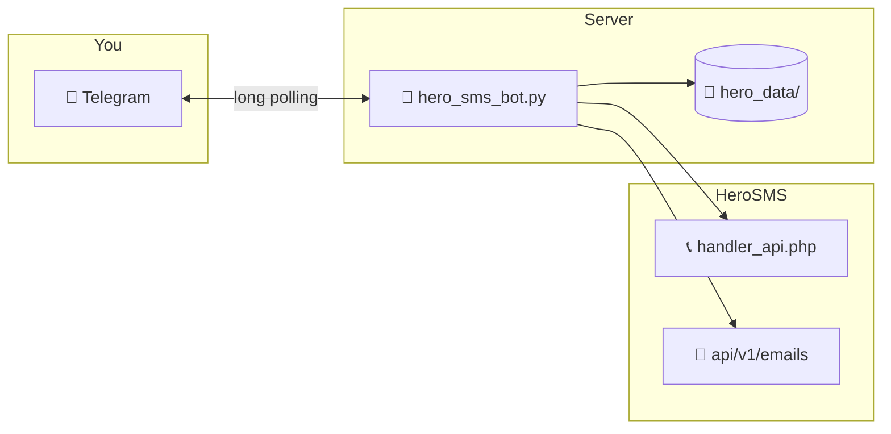

<div align="center">

# 📱 HeroSMS Telegram Bot

### One-file private bot for [HeroSMS](https://hero-sms.com) — SMS numbers & email verification in Telegram

[](https://www.python.org/)
[]()
[](LICENSE)

Buy virtual numbers · receive OTP codes · manage email inboxes — all from a pretty button menu.

[Features](#-features) · [Quick start](#-quick-start-5-minutes) · [Deploy 24/7](#-run-247-systemd-linux) · [Commands](#-commands-by-category) · [Troubleshooting](#-troubleshooting)

</div>

---

## ✨ Features

| Area | What you get |
|------|----------------|
| 🛒 **Guided Buy SMS** | Pick app → country (sorted by price, stock only) → confirm |
| 📧 **Guided Buy Email** | Pick website → inbox domain → confirm (HeroSMS REST API v1) |
| ⭐ **Favorites** | One-tap rebuy (default: 🇹🇷 Turkey TG, 🇨🇱 Chile TG) |
| 📨 **Auto alerts** | New SMS/email codes pushed to Telegram with **Copy code** button |
| 📱 **Active orders** | See numbers still waiting for a code |
| 💰 **Balance** | Check wallet; low-balance warnings |
| 📖 **Help** | Single-page guide organized **by category** (no split pages) |
| 🔒 **Private** | Only **your** Telegram user ID can use the bot |
| 🧪 **Self-test** | `python hero_sms_bot.py --test` checks Telegram + HeroSMS |
| 📦 **Zero pip deps** | Pure Python stdlib — great for cheap VPS |

---

## 🏗 How it works



1. You tap **Buy SMS** or **Buy email** in Telegram.  
2. The bot calls HeroSMS and gives you a number or email address.  
3. A background poller checks every ~12 seconds for new codes.  
4. When a code arrives, you get a message with a **Copy** button.

---

## 📋 Requirements

| Item | Details |
|------|---------|
| 🐍 **Python** | 3.10 or newer |
| 🤖 **Telegram bot token** | From [@BotFather](https://t.me/BotFather) |
| 🔑 **HeroSMS API key** | From [hero-sms.com](https://hero-sms.com) → profile / API |
| 💵 **HeroSMS balance** | Top up before buying numbers |
| 🖥 **Something always on** | VPS, home server, or PC for 24/7 (see below) |

> **Note:** SMS uses `https://hero-sms.com/stubs/handler_api.php`.  
> Email uses `https://hero-sms.com/api/v1` with header `Authorization: ApiKey YOUR_KEY`.

---

## 🚀 Quick start (5 minutes)

### 1️⃣ Get credentials

| Secret | Where to get it |
|--------|-----------------|
| `TELEGRAM_TOKEN` | [@BotFather](https://t.me/BotFather) → `/newbot` → copy token |
| `ALLOWED_USER_ID` | [@userinfobot](https://t.me/userinfobot) → your numeric **Id** |
| `HEROSMS_API_KEY` | [hero-sms.com](https://hero-sms.com) → account → API key |

### 2️⃣ Clone & configure

```bash
git clone https://github.com/YOUR_USERNAME/YOUR_REPO.git
cd YOUR_REPO
cp .env.example .env   # then edit .env (never commit it)
```

**Recommended — environment variables (do not commit secrets):**

```bash
# Linux / macOS
export TELEGRAM_TOKEN="123456789:ABCdefGHI..."
export HEROSMS_API_KEY="your_hero_sms_api_key"
export ALLOWED_USER_ID="123456789"

# Windows PowerShell
$env:TELEGRAM_TOKEN="123456789:ABCdefGHI..."
$env:HEROSMS_API_KEY="your_hero_sms_api_key"
$env:ALLOWED_USER_ID="123456789"
```

Copy `.env.example` → `.env` and fill in your values. **Never commit `.env`** — it is in `.gitignore`.

### 3️⃣ Bootstrap (optional, first time on a new machine)

```bash
python hero_sms_bot.py --install
```

Creates `hero_data/`, `requirements.txt`, and ensures pip is available. **No third-party packages required** to run.

### 4️⃣ Test everything

```bash
python hero_sms_bot.py --test
```

You should see `PASSED` for Telegram and HeroSMS (including email API if enabled on your account).

### 5️⃣ Run the bot

```bash
python hero_sms_bot.py
```

Open your bot in Telegram → send **`/start`** → use the menu buttons.

---

## ⚙️ Configuration

All settings can be set via **environment variables** or in `hero_sms_bot.py`:

| Variable | Default | Description |
|----------|---------|-------------|
| `TELEGRAM_TOKEN` | *(required)* | Bot token from BotFather |
| `HEROSMS_API_KEY` | *(required)* | HeroSMS API key |
| `ALLOWED_USER_ID` | *(required)* | Only this Telegram user can use the bot |
| `BALANCE_ALERT_LOW` | `2.0` | Warn when balance below this (USD) |
| `POLL_INTERVAL_SEC` | `12` | Seconds between code checks (in code) |

### 📁 Data files (auto-created)

| Path | Purpose |
|------|---------|
| `hero_data/favs.json` | Your ⭐ favorites |
| `hero_data/state.json` | Low-balance alert state |
| `hero_data/.hero_bootstrapped` | Bootstrap marker (optional) |

---

## 🎛 Telegram menu

After `/start` you get inline buttons:

| Button | Action |
|--------|--------|
| 📱 **Active SMS** | Numbers waiting for a code |
| ⭐ **Favorites** | Saved one-tap buys |
| 🛒 **Buy SMS** | Guided: service → country → confirm |
| 📧 **Buy email** | Guided: site → domain → confirm |
| 💰 **Balance** | HeroSMS wallet |
| 📖 **Help** | Full command list by category |

---

## 📖 Commands by category

Send **`/help`** in the bot for the live guide. Summary:

### 🏠 Getting started
`/start` · `/menu` · `/help` · `/balance` · `/alertbalance` · `/notify` · `/poll`

### 🛒 Buy SMS
`/buy tg 62` · `/buyv2` · `/countries` · `/services` · `/prices` · `/numbers` · `/operators` · `/top tg`

### 📱 SMS orders
`/active` · `/status ID` · `/sms ID` · `/ready ID` · `/resend ID` · `/complete ID` · `/cancel ID` · `/finish ID` · `/history`

### 📧 Email
`/email instagram.com gmail.com` · `/domains site.com` · `/emails` · `/mail ID` · `/mailcancel ID` · `/mailreorder ID`

### ⭐ Favorites
`/favs` · `/favbuy tr_tg` · `/favadd name tg 62` · `/favlabel` · `/favdel`

### 🏷 Popular service codes
`tg` Telegram · `wa` WhatsApp · `ig` Instagram · `go` Google · `fb` Facebook · `ds` Discord

---

## 🧪 Testing

```bash
python hero_sms_bot.py --test
```

| Check | What it does |
|-------|----------------|
| Auth whitelist | Verifies `ALLOWED_USER_ID` logic |
| Telegram `getMe` | Bot token valid |
| Telegram send | Sends a test message to you |
| HeroSMS balance | API key + SMS API |
| Countries / active | API connectivity |
| Email v1 | `GET /api/v1/emails` + domains |

Fix any `FAILED` lines before running 24/7.

---

## 🌐 Deploy on a VPS (production)

### Recommended stack

- **Ubuntu 22.04/24.04** (or Debian) on any VPS (Hetzner, DigitalOcean, Vultr, etc.)
- **1 vCPU / 512 MB RAM** is enough — the bot is very light
- **systemd** keeps it running 24/7 and restarts on crash/reboot

### 1️⃣ Server setup

```bash
sudo apt update && sudo apt upgrade -y
sudo apt install -y python3 python3-pip python3-venv git
```

### 2️⃣ Create a dedicated user (recommended)

```bash
sudo useradd -m -s /bin/bash herobot
sudo su - herobot
git clone https://github.com/YOUR_USERNAME/YOUR_REPO.git ~/herosms-bot
cd ~/herosms-bot
python3 hero_sms_bot.py --install
python3 hero_sms_bot.py --test
```

### 3️⃣ Store secrets safely

```bash
mkdir -p ~/.config/herosms-bot
nano ~/.config/herosms-bot/env
```

```bash
TELEGRAM_TOKEN=your_token_here
HEROSMS_API_KEY=your_key_here
ALLOWED_USER_ID=your_telegram_id
BALANCE_ALERT_LOW=2.0
```

```bash
chmod 600 ~/.config/herosms-bot/env
```

---

## ⏰ Run 24/7 (systemd — Linux)

Create a systemd service (run as **root** or with `sudo`):

```bash
sudo nano /etc/systemd/system/herosms-bot.service
```

```ini
[Unit]
Description=HeroSMS Telegram Bot
After=network-online.target
Wants=network-online.target

[Service]
Type=simple
User=herobot
Group=herobot
WorkingDirectory=/home/herobot/herosms-bot
EnvironmentFile=/home/herobot/.config/herosms-bot/env
ExecStart=/usr/bin/python3 /home/herobot/herosms-bot/hero_sms_bot.py
Restart=always
RestartSec=10
# Hardening (optional)
NoNewPrivileges=true
PrivateTmp=true

[Install]
WantedBy=multi-user.target
```

Enable and start:

```bash
sudo systemctl daemon-reload
sudo systemctl enable herosms-bot
sudo systemctl start herosms-bot
```

### 📊 Useful commands

```bash
sudo systemctl status herosms-bot      # Is it running?
sudo journalctl -u herosms-bot -f      # Live logs
sudo systemctl restart herosms-bot     # After config change
sudo systemctl stop herosms-bot        # Stop
```

You should see in logs:

```text
HeroSMS balance: ...
HeroSMS email API (v1) OK
Bot running for user id ...
```

---

## 🪟 Run 24/7 on Windows

### Option A — Keep a terminal open (testing only)

```powershell
cd C:\path\to\herosms-bot
$env:TELEGRAM_TOKEN="..."
$env:HEROSMS_API_KEY="..."
$env:ALLOWED_USER_ID="..."
python hero_sms_bot.py
```

### Option B — Task Scheduler (stays up after logoff)

1. Open **Task Scheduler** → **Create Task**
2. **General:** name `HeroSMS Bot`, run whether user is logged on or not
3. **Triggers:** At startup (or At log on)
4. **Actions:** Start a program  
   - Program: `C:\Python311\python.exe`  
   - Arguments: `hero_sms_bot.py`  
   - Start in: `C:\path\to\herosms-bot`
5. **Settings:** Restart on failure every 1 minute
6. Add env vars via a wrapper `.bat` file if needed:

```bat
@echo off
set TELEGRAM_TOKEN=your_token
set HEROSMS_API_KEY=your_key
set ALLOWED_USER_ID=your_id
cd /d C:\path\to\herosms-bot
python hero_sms_bot.py
```

### Option C — NSSM (Windows service)

```powershell
nssm install HeroSMSBot "C:\Python311\python.exe" "C:\path\to\herosms-bot\hero_sms_bot.py"
nssm set HeroSMSBot AppDirectory "C:\path\to\herosms-bot"
nssm set HeroSMSBot AppEnvironmentExtra TELEGRAM_TOKEN=xxx HEROSMS_API_KEY=xxx ALLOWED_USER_ID=xxx
nssm start HeroSMSBot
```

---

## 🐳 Docker (optional)

The bot needs no extra packages; a minimal image works:

**`Dockerfile`**

```dockerfile
FROM python:3.12-slim
WORKDIR /app
COPY hero_sms_bot.py .
RUN mkdir -p hero_data
ENV PYTHONUNBUFFERED=1
CMD ["python", "hero_sms_bot.py"]
```

**`docker-compose.yml`**

```yaml
services:
  herosms-bot:
    build: .
    restart: unless-stopped
    environment:
      TELEGRAM_TOKEN: ${TELEGRAM_TOKEN}
      HEROSMS_API_KEY: ${HEROSMS_API_KEY}
      ALLOWED_USER_ID: ${ALLOWED_USER_ID}
    volumes:
      - ./hero_data:/app/hero_data
```

```bash
docker compose up -d --build
docker compose logs -f
```

---

## 🔐 Security checklist (GitHub & production)

- [ ] **Never commit** `.env` or real tokens — only `.env.example` with empty values
- [ ] **Rotate keys** if they were ever committed to git (BotFather + HeroSMS dashboard)
- [ ] Add to **`.gitignore`**: `hero_data/`, `.env`, `*.log`, `__pycache__/`
- [ ] If keys were ever leaked → rotate via **BotFather** and HeroSMS dashboard
- [ ] `ALLOWED_USER_ID` locks the bot to **you only** — double-check the ID
- [ ] Run the bot under a **dedicated Linux user**, not root
- [ ] Firewall: bot only needs **outbound HTTPS** (no open ports)

---

## 📂 Project structure

```text
.
├── hero_sms_bot.py      # 🤖 Entire bot (single file)
├── README.md            # 📖 You are here
├── requirements.txt     # 📦 Auto-generated (usually empty = stdlib only)
└── hero_data/           # 💾 Created at runtime (gitignore this)
    ├── favs.json
    └── state.json
```

---

## 🔧 Troubleshooting

| Problem | Fix |
|---------|-----|
| `Set TELEGRAM_TOKEN` on start | Export env vars or edit config in `hero_sms_bot.py` |
| Bot doesn’t reply | Only `ALLOWED_USER_ID` works — check [@userinfobot](https://t.me/userinfobot) |
| `Not authorized` on buttons | Same — wrong Telegram ID |
| `NO_NUMBERS` when buying | Pick another country; bot returns you to country list |
| `NO_BALANCE` | Top up at [hero-sms.com](https://hero-sms.com) |
| Email “unavailable” | Email needs REST v1 + `ApiKey` auth; run `--test` |
| Old menu buttons dead | Send `/start` again for fresh keyboards |
| Two bots running | Stop duplicate processes (see below) |
| Help was split 1/2, 2/2 | Updated — now **one** categorized help page |

### Stop duplicate bots (Windows)

```powershell
Get-CimInstance Win32_Process | Where-Object { $_.CommandLine -match 'hero_sms_bot' } |
  ForEach-Object { Stop-Process -Id $_.ProcessId -Force }
```

### Stop duplicate bots (Linux)

```bash
sudo systemctl stop herosms-bot
# or: pkill -f hero_sms_bot.py
```

---

## 🔄 Updating

```bash
cd ~/herosms-bot
git pull
python3 hero_sms_bot.py --test
sudo systemctl restart herosms-bot
```

Your favorites in `hero_data/favs.json` are preserved across updates.

---

## 🤝 Contributing

Issues and PRs welcome. Please **do not** include real API keys in commits.

---

## ⚠️ Disclaimer

This project is **not affiliated** with HeroSMS or Telegram. You are responsible for complying with HeroSMS [terms](https://hero-sms.com/rules), local laws, and platform rules when using virtual numbers. Use at your own risk.

---

## 📄 License

MIT License — see [LICENSE](LICENSE).

---

<div align="center">

**Made with ❤️ for private HeroSMS workflows**

⭐ Star the repo if it helped you · 🐛 Open an issue if something breaks

[HeroSMS](https://hero-sms.com) · [API docs](https://hero-sms.com/api) · [BotFather](https://t.me/BotFather)

</div>
